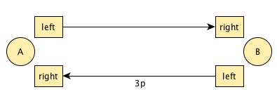
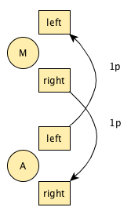
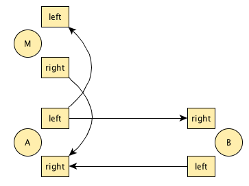
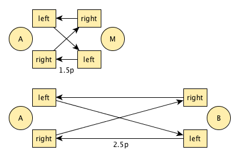

# Overlay Takeouts

## Abstract
__In this post we propose a new way of finding *passing takeout patterns* that allow for a great a variety of rhythms _both_ for the passing part _and_ for the manipulation part. Specifically, our technique gives us a great distribution over right and left hands. These true ambidextrous patterns are much in contrast to most takeouts juggled over the past decade. The broad recipe is to _overlay_ a passing and a mini pattern. We explain the general approach in detail, and provide two examples of quite promising rhythms.__

## Related Work
Some references

* [Take That Out](https://vimeo.com/28502455)
* [Get The Shoe](https://www.youtube.com/watch?v=Yemkg_z7MAE)
* [Berlin Variations incl. Ass](https://www.youtube.com/watch?v=49Z7-wo_XtI)
* [Aidan Burns](http://www.geocities.ws/aidanjburns/passing.html)

Mostly 3 club cascade with [substitution, intercept and carry](http://ezine.juggle.org/2014/05/26/scrambled-passing-patterns-and-takeout-notations-part-1/)

* [Christophe Prechac's Article](https://www.passingdb.com/articles.php?id=13)
* [Gandini Prechac Patterns](http://www.owenreynolds.net/notation/Symmetric_patterns_C.pdf)
* [Social Siteswaps](https://www.youtube.com/watch?v=W_G74eLnK1U)
* [Under Prechac](http://underprechac.de)
Arbitrary Prechac Siteswap Patterns with period 3 to 7 clubs and period 2 to 6

Our idea was to rejoin these two line of development i.e. have runaround, but relax some restrictions and do some fun period 5 stuff with 4, 2p and 1 in it - there is more to life than single selves and single passes!

## Generating Overlay Takeouts
Let's first look at a simplistic proof of concept. This should explain the procedure while keeping the clubs low and number easy to deal with

### Step 1: Pick any two person passing pattern
In this case it should be super mellow, so let's go for [5 clubs, period 4](http://prechacthis.org/index.php?persons=2&objects=5&lengths=4&max=3&passesmin=1&passesmax=4&jugglerdoes=&exclude=&clubdoes=&react=&results=): This one looks feasible: [3p 3 1 3]("http://prechacthis.org/info.php?pattern=[p(3,1,5),p(3,0,3),p(1,0,1),p(3,0,3)]&persons=2&swap=[]&back=persons%3D2%26amp%3Bobjects%3D5%26amp%3Blengths%3D4%26amp%3Bmax%3D3%26amp%3Bpassesmin%3D1"). Let's set it up face to face with classic straight 3p from right to left:

The only restriction is that there must be one self that is higher than half the period, in this case 3 or higher. This self will be shared between passer _A_ and the manipulator. To transform it into a shared pass, we have to subtract half the period (check [Sean's](http://www.owenreynolds.net/notation/Symmetric_patterns_C.pdf) or the [wikibook's](https://en.wikibooks.org/wiki/Juggling/Symmetric_Passing_Patterns) explanation). So we turn a 3 into a 1p that that is exchanged _symmetrically_
between passer _A_ and manipulator _M_, while _A_ and _B_ share the 3p.

Be sure to be comfortable with this pattern at first.

### Step 2: Create a manipulation pattern
Now this is a little more complicated.

* It must have the same period, here 4.
* It must the pass that we created in the last step, and _only_ that pass, here 1p.
* It should not have not too many clubs, say 3.

As this can get slightly complicated, [you can ask prechacthis.org]("http://prechacthis.org/index.php?persons=2&objects=3&lengths=4&max=3&passesmin=1&passesmax=1&jugglerdoes=1p")

We gave [3 1 1p 1]("http://prechacthis.org/info.php?pattern=[p(3,0,3),p(1,0,1),p(1,1,3),p(1,0,1)]&persons=2&swap=[]&back=persons%3D2%26amp%3Bobjects%3D3%26amp%3Blengths%3D4%26amp%3Bmax%3D3%26amp%3Bpassesmin%3D1%26amp%3Bpassesmax%3D1%26amp%3Bjugglerdoes%3D1p") a try. You can arrange this pattern in different ways. One practical solution is to do it side by side with the 1p going inside to outside:

### Step 3: Overlay the two patterns
From the perspective of juggler _B_, she is just doing the passing pattern. The manipulator _M_ is just doing the mini pattern. Passer _A_, however, is doing _both at once_, i.e. 3p 3 3 1 1p. This is going to feel weird - no matter how well you master both patterns separately.

Once you can short cut the smart but slow parts of your brain this feels quite intriguing, though. As the throws are quite simple in this case, we could not resist the temptation to turn it into a roundabout right away:

<video width="640" height="360" controls preload="metadata" 
    <source src="delightful.mp4" type="video/mp4" />
</video>

  
## Initial Results
After this rather conventional experiment we went for something more exotic. We wanted a 5 club, period 5 base pattern. Let there be a 4, so we end up with a 1.5p - that should feel like a takeout's smash-in. This is what [PrechacThis offers us](http://prechacthis.org/index.php?persons=2&objects=5&lengths=5&max=4&passesmin=1&passesmax=1&jugglerdoes=&exclude=&clubdoes=1+4+or+2+4&react=&results=42).

[4 2.5p 1 2 3]("http://prechacthis.org/info.php?pattern=[p(1,0,1),p(2,0,2),p(3,0,3),p(4,0,4),p(2.5,1,5)]&persons=2&swap=[]&back=persons%3D2%26amp%3Bobjects%3D5%26amp%3Blengths%3D5%26amp%3Bmax%3D4%26amp%3Bpassesmin%3D1%26amp%3Bpassesmax%3D1%26amp%3Bjugglerdoes%3D%26amp%3Bexclude%3D%26amp%3Bclubdoes%3D1%2B4%2Bor%2B2%2B4") - this looks fun:

<video width="640" height="360" controls preload="metadata" poster="http://juggling.tv/thumb/l-0_3972.jpg">
    <source src="missionImpossible.mp4#t=40s" type="video/mp4" />
</video>					

Ok, what mini pattern could we fit in? [It must be period 5 and have a 1.5p in it](http://prechacthis.org/index.php?persons=2&objects=3&lengths=5&max=3&passesmin=1&passesmax=1&jugglerdoes=1.5p). In that list, there is [0 1 2 3 1.5p]("http://prechacthis.org/info.php?pattern=[p(0,0,0),p(1,0,1),p(2,0,2),p(3,0,3),p(1.5,1,4)]&persons=2&swap=[]&back=persons%3D2%26amp%3Bobjects%3D3%26amp%3Blengths%3D5%26amp%3Bmax%3D3%26amp%3Bpassesmin%3D1%26amp%3Bpassesmax%3D1%26amp%3Bjugglerdoes%3D1.5p"). It looks like this:

<video width="640" height="360" controls preload="metadata" poster="http://juggling.tv/thumb/l-0_3972.jpg">
    <source src="missionImpossible.mp4#t=26s" type="video/mp4" />
</video>					

So in total we end up with:

* _A_: 1 2 3 1.5p 2.5p
* _M_: 0 1 2 3 1.5p
* _B_: 1 2 3 4 2.5p

As this is period 5, one of the jugglers has to throw tram line and the other cross. This holds for both the 1.5p (smash-in) and the 2.5p ("haff"/"joe pass"/flat pass). The passers have to agree on who goes straight an who crosses the 2.5p. For the 1.5p, the manipulator can dodge the flat passes best if she smashes the 1.5p straight, while the passer doing the overlay smashes the 1.5p _cross_. Note that in contrast to conventional takeouts the passer, too, has a smash in.

We modestly ( ;-) ) call this variation Mission Impossible, not because it was difficult (give it a spin!), but because that classic movie theme is the fanciest 5 fourth song on earth, try chanting along the rhythm!

<iframe width="100%" height="450" scrolling="no" frameborder="no" src="https://w.soundcloud.com/player/?url=https%3A//api.soundcloud.com/tracks/70927998&amp;auto_play=false&amp;hide_related=false&amp;show_comments=true&amp;show_user=true&amp;show_reposts=false&amp;visual=true"></iframe>

Once you have the pattern solid you can move on the Impossible Round about.

## Future Work